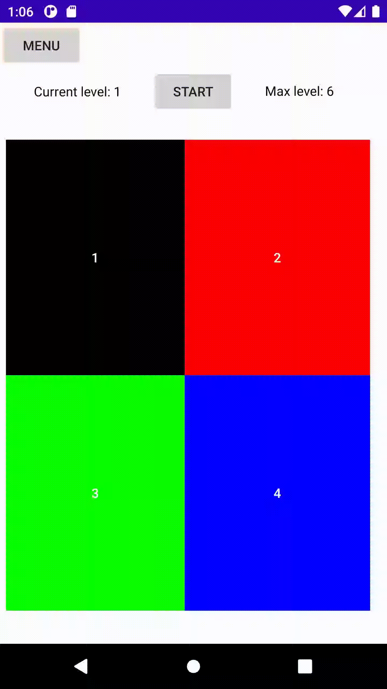
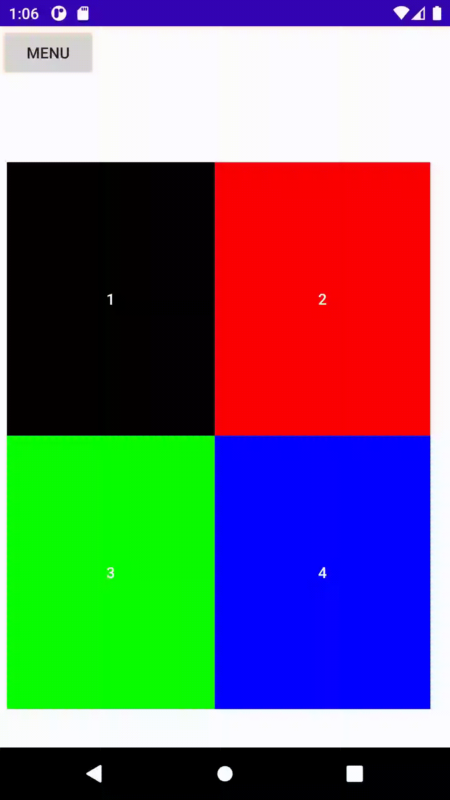
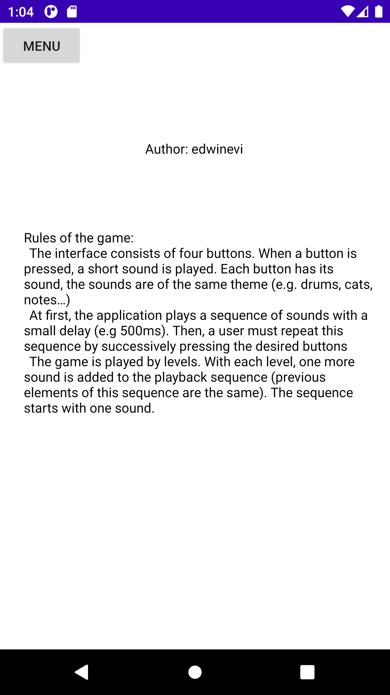

# Game "Repeat the sequence" on Android.

## Rules of the game:
- The interface consists of four buttons. When a button is pressed, a short sound is played. Each button has its sound, the sounds are of the same theme (e.g. drums, cats, notes…)
- At first, the application plays a sequence of sounds with a small delay (e.g 500ms). Then, a user must repeat this sequence by successively pressing the desired buttons
- The game is played by levels. With each level, one more sound is added to the playback sequence (previous elements of this sequence are the same). The sequence starts with one sound.

## Mode 1. A basic game
- On application start, the main screen with buttons is opened. Game starting after press button "start"
- When an app is playing a sound or a user pushes the button, this button is highlighted
- The buttons are placed into 2 lines (2 x 2)
- There is a level counter on the screen.
- An app saves a record number of levels
- The first incorrectly pressed button causes a game loss. A dialog is with the resulting number of levels, a game record, and a "Restart" button.  

## Mode 2. Free play
Free play mode allows you to open the game screen, but the sequences are not played and there is no level counter. It is possible to press the buttons in any sequence. In the upper left corner there is a back arrow (to exit the menu).  

## About
"About" button opens a new screen, where the game conditions and information about the author are written. In the upper left corner there is a back arrow (to exit the menu)  

## Release
In release folder you can find release apk file for test it in your android device.
